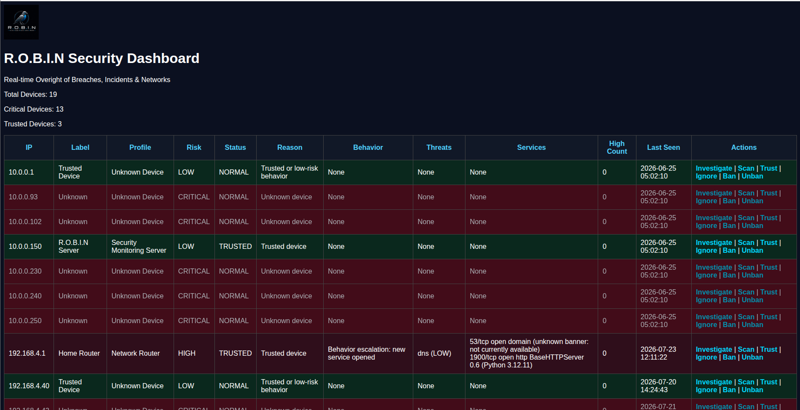
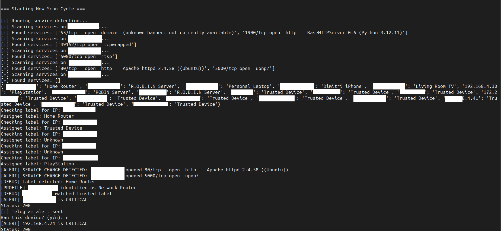
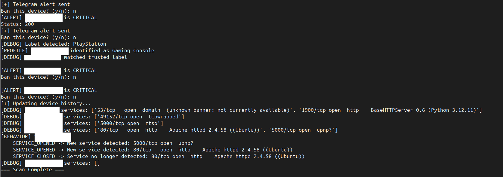
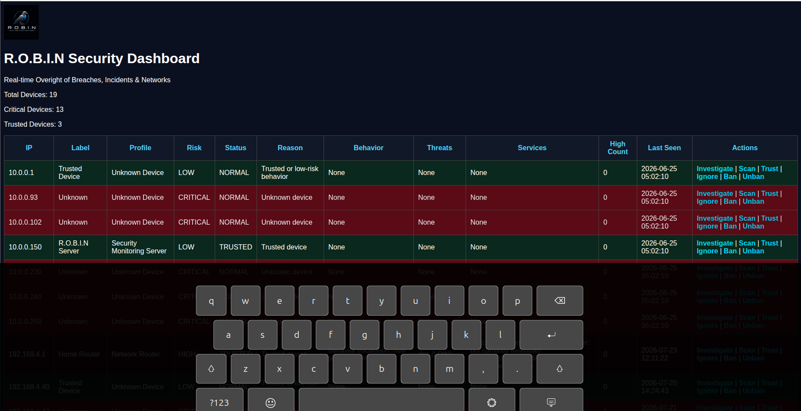

# R.O.B.I.N

## Real-time Oversight of Breaches, Incidents, & Networks

R.O.B.I.N is a cybersecurity monitoring and threat detection platform designed to identify suspicious devices, exposed services, and potential network threats in real time.

The project focuses on helping usersmonitor local networks, analyze device behavior, classify risks, and improve visibility into cybersecurity threats through automated analysis and reporting.

---

# Features

## Device Discovery
- Detects active devices on the network
- Identifies IP addresses, MAC addresses, hostnames, and vendor
- Tracks known and unknown devices

## Risk Classification
- Labels devices based on threat severity
- Supports LOW, MEDIUM, HIGH< and CRITICAL risk levels
- Tracks recurring susupicious activity

## Threat Intelligence 
- Analyzes exposed ports and services
- Maps ports to security risks using a custom CVE/threat intelligence database
- Provides security recommendations for detected services

## Device History Tracking
- Stores historical scan data
- Tracks first seen and last seen timestamps
- Monitors repeated high-risk detections

## Dashboard Support
- Includes a live monitoring dashboard
- Displays devices, risks, and threat information
- Designed for future real-time visualization improvements

## Future Development
Planned features include:
- Real-time monitoring
- Automated alerting
- Telegram notifications
- Threat scoring improvements
- Auto-blocking using fail2ban/UFW
- Machine learning threat detection
- Advanced reporting and analytics

## Current Status

✅ Phase 1 – Network Discovery (Complete)

- Network scanning
- Device discovery
- Device inventory
- Baseline creation

✅ Phase 2 – Device Identification (Complete)

- Device labeling
- Device fingerprinting
- Vendor identification
- Device profiling

✅ Phase 3 – Risk Analysis (Complete)

- Risk engine
- Trusted devices
- Critical device detection
- Telegram notifications
- Dashboard integration

✅ Phase 4 – Threat Intelligence (Complete)

- Local threat intelligence database
- Service-to-threat mapping
- CVE mapping framework
- Threat classification
- Historical device tracking

✅ Phase 5 – Intelligent Threat Detection (Complete)

- Nmap service/version detection
- Behavioral analysis engine
- New device detection
- Opened/closed service detection
- Hostname change detection
- MAC address change detection
- Vendor change detection
- Behavior-based risk escalation
- Dashboard behavior tracking
- Service history tracking
- Threat history tracking
- Telegram alert integration
- Interactive investigation dashboard

---

# Technologies

- Python 3
- Flask
- Nmap
- Linux / Ubuntu
- Git and GitHub
- JSON-based threat intelligence
- Fail2Ban
- UFW firewall
- Telegram Bot API
- HTML
- CSS
---

## Future Roadmap

#  Phase 6 – Incident Response

- Incident management
- Automated response policies
- Auto-remediation
- Reporting
- Evidence collection
- Timeline reconstruction

#  Phase 7 – AI Threat Analysis

- AI-assisted anomaly detection
- Threat prediction
- Intelligent recommendations
- Attack correlation

#  Phase 8 – Enterprise Features

- Multi-user authentication
- SIEM integration
- API support
- Enterprise reporting

---

## Dashboard

## Terminal Scan

## Telegram Alerts 

## Investigate Page

---

# Installation

Cline the repository:

'''bash
git clone https://github.com/Shuvieltech32/ROBIN.git
cd ROBIN

# Warning

R.O.B.I.N is intended for educational, defensive, and authorized security monitoring purposes only.

Do not use this project on networks or systems you do not own or have permission to test.

# Author 

Dimitri Elder
Founder of R.O.B.I.N 
Cybersecurity Student & Security Researcher
